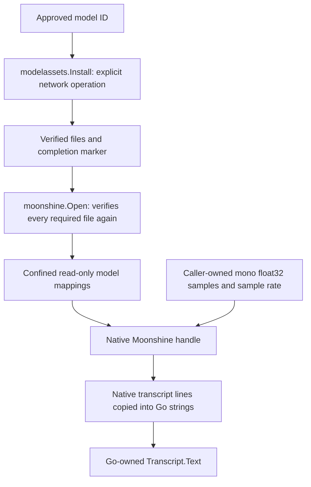

# Local Moonshine PCM smoke test

This developer-only path proves approved model assets → local native inference
→ transcript text. It does not capture microphones or connect speech to Thoughts'
browser, TUI, application runtime or database. Ordinary builds and tests require
no native runtime; opening verified assets in those builds returns
`speech.ErrRuntime`.

## PCM and the input format

**PCM (pulse-code modulation)** represents an audio waveform as a sequence of
numbers called samples. Each sample records the signal's amplitude at one point
in time. The speech adapter accepts these numbers directly as `[]float32`; it
does not accept a WAV file, MP3 file or microphone device.

- **Mono** means one audio channel: each successive value is the next sample in
  time. Stereo has two channels and is not this input format.
- **Sample rate** is the number of samples per second, measured in hertz (Hz).
  At 16,000 Hz, 16,000 mono samples represent one second. Pass the recording's
  actual rate; changing the rate argument does not convert the samples.
- **Float32** is a 32-bit floating-point number. Samples use normalized amplitude
  in `[-1, 1]`, with `0` representing zero signal amplitude. Negative amplitudes
  are normal. NaN (not a number), infinity and values outside that range are
  rejected, rather than silently changed.

### Why the smoke file says little-endian

The developer command reads a raw `.f32le` fixture: **f**loat, **32** bits,
**l**ittle-**e**ndian. It has no header, channel information or sample-rate
metadata. Every four bytes encode one IEEE 754 float32 sample, in time order;
`-sample-rate` supplies the rate separately. A WAV container can hold PCM, but
its header makes it a different file format; do not pass WAV bytes to this
command. The same applies to signed 16-bit PCM, stereo or compressed audio.

**Endianness means byte order.** A 32-bit value occupies four bytes. Little-endian
stores the least significant byte first; big-endian stores it last. For example,
the floating-point sample `1.0` has the bit pattern `0x3f800000`:

| Encoding | Four bytes in the file (hexadecimal) |
|---|---|
| Little-endian, accepted by this command | `00 00 80 3f` |
| Big-endian, a different encoding | `3f 80 00 00` |

`decodePCM` first reads four bytes in the specified order using
`binary.LittleEndian.Uint32`, then `math.Float32frombits` interprets those bits
as a floating-point sample. This is not a numerical integer-to-float conversion:
converting the integer `0x3f800000` numerically would produce a large number,
rather than the sample `1.0`. The decoder rejects empty files and partial
four-byte samples; the speech adapter checks amplitude and finiteness.

Byte order matters at this file boundary. Callers already holding `[]float32`
pass those values directly to `Transcribe`; they do not serialize them or choose
an endian format. Keep the slice unchanged until the call returns.

The committed fixture contains 93,680 mono samples at 16,000 Hz:
`93,680 / 16,000 = 5.855` seconds and `93,680 × 4 = 374,720` bytes. See
[the fixture notes](../internal/speech/moonshine/testdata/README.md) for the
licensed source, conversion and checksums. This decoder is developer-tool
plumbing, not a browser audio protocol or a production audio-file importer.

## Architecture and where ownership changes



Installation and inference are separate so missing or changed assets cannot
cause inference to make a hidden network request. `Open` hashes all required
files through modelassets, so opening a model is deliberately more expensive
than checking whether a directory exists. URLs, hashes and model-file sizes
come only from the application-owned catalog.

| Code | Responsibility and lifetime |
|---|---|
| `internal/modelassets` | Downloads only the approved manifest; checks size/hash and commits installation through its completion marker. |
| `moonshine/transcriber.go` | Portable input validation, context checks, shared lifecycle state and fixed safe errors. Copies of a transcriber share this state. |
| `moonshine/model_files_linux.go` | Opens verified files through `os.Root` and maps their bytes read-only. A mapping makes file contents accessible in memory without copying the whole file into a Go slice allocation. |
| `moonshine/native_linux.go` | Uses cgo (Go's bridge to C) to create/use/free the native handle. Model mappings must stay alive because native sessions retain pointers to them. Native transcript pointers never cross this boundary; returned lines are copied into Go strings. |
| `moonshineRuntimeGate` | Serializes all adapter instances, including loading, inference and cleanup, because Moonshine has process-wide state. Waiting for the gate is cancellable. |
| `Transcriber.Close` | Frees the native handle before unmapping its model files. This order prevents native code from accessing released memory. Repeated closes, including closes on copies, return the stored outcome. |
| `cmd/moonshine-smoke` | Developer-only file decoding, explicit installation and timing/output. The adapter neither reads audio files nor persists audio/transcripts. |

An entered native call is synchronous and cannot be interrupted through Go's
context. Cancellation prevents entry or discards its result after it finishes;
it does not let Close free resources while inference still uses them. Returned
Go strings remain valid across later inference and Close.

The `moonshine && cgo && linux && amd64` build constraint isolates the native
implementation. **amd64** means the x86-64 CPU architecture; it is unrelated to
Moonshine's **model architecture**, which identifies a neural model layout such
as Small Streaming. Ordinary builds select the unavailable-runtime implementation
and need no C headers or libraries. The portable package owns lifecycle policy;
the tagged file owns C memory and calls. This split does not implement another
platform or wire speech into the application.

## Upstream contract

The integration pins Moonshine Voice v0.1.5, upstream commit
`234f60faa0eb388b01cdf7e60aca232af37aefda`, C header/runtime version **3.0.0**
(`30000`) and architecture `SMALL_STREAMING` (`4`). The package version and C API
version are different. The header and runtime version must match this pin.

Official sources:

- https://github.com/moonshine-ai/moonshine/releases/tag/v0.1.5
- https://github.com/moonshine-ai/moonshine/blob/v0.1.5/core/moonshine-c-api.h
- https://github.com/moonshine-ai/moonshine/blob/v0.1.5/core/moonshine-model-catalog.cpp
- https://github.com/moonshine-ai/moonshine/blob/v0.1.5/core/moonshine-model-file-metadata.generated.cpp
- https://moonshine-voice.readthedocs.io/en/stable/api/options/

The approved model ID is `moonshine-small-streaming-en`, revision
`quantized_26_08_21`. The private modelassets manifest pins eight CDN files:
`adapter.ort`, `cross_kv.ort`, `decoder_kv.ort`, `encoder.ort`,
`frontend.model.ort`, `frontend.weights.ort`, `streaming_config.json`, and
`tokenizer.bin`. Each URL, exact size and SHA-256 is pinned in the catalog.
The optional attention decoder is omitted because word timestamps are disabled.
Upstream publishes dated directories as immutable; an unexpected byte change
fails verification rather than accepting an updated model.

Moonshine's code and this streaming English model are MIT, copyright 2025
Useful Sensors, Inc. (dba Moonshine AI); see
[the retained MIT notice](../internal/speech/moonshine/LICENSE-MOONSHINE) and
https://github.com/moonshine-ai/moonshine/blob/v0.1.5/LICENSE.
ONNX Runtime is MIT; other upstream third-party components retain their own
licenses, including Eigen's MPL-2.0 subset. No native binaries or weights are
redistributed in this repository. The separate speech fixture is CC BY 4.0;
see [its attribution and checksums](../internal/speech/moonshine/testdata/README.md).

## Local Linux x86-64 setup

Native code requires Linux amd64, cgo, a C compiler, the `moonshine` build tag,
the official header, `libmoonshine.so`, and the bundled `libonnxruntime.so.1`.
The tag is deliberate: missing tagged dependencies can fail linking or dynamic
loading before Go starts. Other platforms and untagged builds use the portable
unavailable-runtime implementation. This does not implement iOS.

Download and unpack only into a local directory outside Git. Do not use upstream's
helper installer, which downloads additional models. Do not install globally or
run `ldconfig`. For example:

```sh
mkdir -p /tmp/thoughts-moonshine-runtime
curl -fL https://github.com/moonshine-ai/moonshine/releases/download/v0.1.5/moonshine-voice-linux-x86_64.tar.gz \
  -o /tmp/thoughts-moonshine-runtime/runtime.tar.gz
printf '%s  %s\n' \
  9c3a87fea93ff2ad957938868f95a0a366dce9ff8ad86bde6cdcf5a4cadb51df \
  /tmp/thoughts-moonshine-runtime/runtime.tar.gz | sha256sum --check
# Extract only after that checksum succeeds.
tar -xzf /tmp/thoughts-moonshine-runtime/runtime.tar.gz -C /tmp/thoughts-moonshine-runtime

export THOUGHTS_MOONSHINE_RUNTIME=/tmp/thoughts-moonshine-runtime/moonshine-voice-linux-x86_64
export THOUGHTS_MODELS_DIR=/tmp/thoughts-moonshine-models
export CGO_CFLAGS="-I${THOUGHTS_MOONSHINE_RUNTIME}/include"
export CGO_LDFLAGS="-L${THOUGHTS_MOONSHINE_RUNTIME}/lib"
export LD_LIBRARY_PATH="${THOUGHTS_MOONSHINE_RUNTIME}/lib"
```

`THOUGHTS_MOONSHINE_RUNTIME` names the unpacked bundle for these explicit build
settings; Go does not read it to download or dynamically locate a runtime.
Preserve any additional flags your local build needs. Keep these exports scoped
to your development shell, rather than changing the application's environment.

## Installation, inference and timing

Installation is an explicit network operation through modelassets. Inference
never installs assets and fails if they are missing, incomplete or corrupt.

```sh
go run ./cmd/moonshine-smoke install -models-dir "$THOUGHTS_MODELS_DIR"

go test -tags=moonshine,moonshine_integration -count=1 -v \
  ./internal/speech/moonshine -run TestMoonshineNative_PCM

go run -tags=moonshine ./cmd/moonshine-smoke transcribe \
  -models-dir "$THOUGHTS_MODELS_DIR" \
  -pcm internal/speech/moonshine/testdata/1272-128104-0000.f32le \
  -sample-rate 16000
```

The developer command prints the requested transcript to stdout and numerical
measurements to stderr. It writes no audio or transcript files. PCM input is
mono, float32 little-endian; the adapter accepts an in-memory slice and explicit
positive sample rate. Samples must be finite and in `[-1, 1]`. The signed 32-bit
native sample-rate and batch-length limits are enforced. Moonshine handles its
internal 16 kHz conversion; Thoughts adds no resampler or WAV parser.

`verified_model_open_seconds` times full model verification, mapping and native
loading. It is not a measurement of native loading alone. Audio duration is
sample count divided by sample rate. `real_time_factor` is transcription wall
time divided by audio duration. Build the command before collecting repeated
measurements, run without competing tests/builds, and record filesystem-cache
conditions. Go heap statistics do not establish native memory usage. These
numbers impose no CI performance threshold and do not measure first partial
transcript latency or live-microphone behavior.

## Ownership, privacy and limits

`moonshine.Open(ctx, root)` always selects and fully verifies the approved model.
Keep the caller-owned root open until Open returns and leave its installed files
unchanged until Close. Read-only mappings opened through `os.Root` feed the
current named-memory-file loader: native code receives no model-directory path,
missing-buffer fallback or automatic downloader. The native transcriber owns
references to those buffers, so Close frees the handle before unmapping them.
Call Close explicitly; there are no finalizers. Calls are serialized across
adapter instances because upstream has process-wide diagnostics and partially
protected registry state. Do not call the shared C library directly alongside
this adapter. Transcriber copies share one lifecycle state: closing any copy
closes them all and releases the native resources exactly once.

Caller PCM must remain unchanged until Transcribe returns. Native inference is
synchronous and cannot be interrupted. Context checks prevent entry when already
canceled and discard results when canceled before returning; control may return
only after native inference finishes. There are no detached inference goroutines.
Close waits for native work and attempts all cleanup; repeated calls return the
original close outcome without freeing twice. Transcript text is copied into
Go-owned strings inside the native adapter before crossing into portable Go
code. No-speech results are empty.

The adapter explicitly disables returned audio, API-call logging, ORT-run logging,
transcript logging, debug WAV output, speaker identification and word timestamps.
Only CPU execution is selected. Upstream can still emit unconditional native
failure diagnostics and ONNX warnings; the adapter does not claim to suppress
those. It never forwards native error strings to Go callers, logs authored
content, writes audio, persists text or returns native audio buffers.
Public error strings expose fixed categories; `errors.Is` retains lifecycle and
installation causes, and `errors.As` can retrieve a numeric `NativeStatusError`.
Unwrapped causes may contain paths and must not be logged.

Deferred: Tiny/Whisper and other models, automatic selection/hardware detection,
iOS/Android and other native platforms, browser/microphone transport, AudioWorklet,
PCM WebSockets, application/runtime wiring, resampling/VAD pipelines, partial UI,
draft mutation and session fencing, SQLite speech state, recommendations,
embeddings/LLMs/Python, automatic updates, and native runtime bundling/installers.
